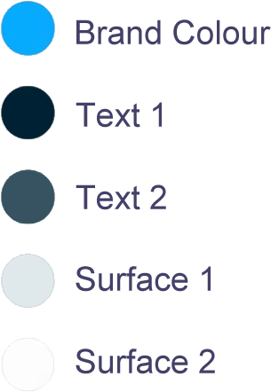

#  KCC Online Shop (MS4)

[View the live project here.](https://kcc-app-shop.herokuapp.com/)

To open links in a new tab:

MAC : &nbsp;  &nbsp; + &nbsp; 'click' 

Windows / Linux : &nbsp;   &nbsp; + &nbsp; 'click'

>This project was undertaken as my submission for the Full Stack Milestone Project (MS4).

## Table of Contents

* [Overview](<#overview>)
* [UX](<#ux>)
  * [User Stories](<#user-stories>)
  * [Strategy](<#strategy>)
  * [Scope](<#scope>)
  * [Structure](<#structure>)
  * [Skeleton](<#skeleton>)
    * [Wireframes](<#wireframes>)
  * [Surface](<#surface>)
    * [Colours](<#colours>)
    * [Typography](<#typography>)
    * [Images](<#images>)
* [Features](<#features>)
* [Testing](<#testing>)
* [Technologies Used](<#technologies>)
* [Deployment](<#deployment>)
  * [Creation](<#creation>)
  * [Hosting](<#hosting>)
  * [Local](<#local>)
* [Credits](<#credits>)

## Overview

>The KCC Online Shop was designed and developed in partnership with the Kilmacow Community Clean Up Group. Following on from the development of the reports app and static website, the group decided that the next project should include an online shop where visitors could donate to the group or buy items that would contribute to the running costs of the group. The long term goal is to develop a fully dfunctioning web app that encompasses all the elements and functionality of the previous projects.

[Back to Top](<#table-of-contents>)

## UX

### User Stories

It is envisiged that most of the traffic to the app will be members of the Kilmacow Clean Up Group, volunteers, local community members and friends and families of the group.

>#### First Time Visitors

* “I would like to view products available”

* "I would like to register with the KCC to make future purchases easier"

* "I would like details about each product"

* "I would like to be able to search by category, ie. I want to find a gift for someone"

>#### Returning Visitors

* "I would like to see if any new products have been added"

* "I would not like to check my previous purchases"

* "I would like to edit my profile"

[Back to Top](<#table-of-contents>)

>#### Admin Visitors

### Strategy

* Develop and deploy a minimal viable product to explore the viability of a full stack web application that incorporates an online shop. 
* Develop a frontend with a simple / clean UI without the need for bloated CSS / JS frontend frameworks.
* Develop a backend using Django, Relational Database, Python
* Develop a basic user authentication system
* Easy to navigate application / familiar interface
* Incorporate existing branding and colour scheme

[Back to Top](<#table-of-contents>)

### Scope

The scope of the project is to provide the KCC with a working online shop incorporating the design and branding from previous projects. The shop will contain a fully functioning checkout and payment system, an authentication system and a shopping system; which allows visitors to browse the products available to purchase. 

The application should be fully functional on both mobile and desktop devices.

[Back to Top](<#table-of-contents>)

### Structure

The application aims to look and feel bright and airy, using lots of whitespace to allow the elements to breathe. The KCC were delighted with the initial project and reiterated that they would like to incorporate the branding and colours of the kcc brochure project.

#### Home: 

The home section of the app contains a large hero video and welcome message. There are two buttons below the welcome messag, one directs the user to the products page and the other directs the user to the contact page. The client loved the idea of the large hero image that featured in previous projects and requested that we use video in this project.

### Terms & Conditions / Privacy Policy:

The terms and conditions page and the privacy policy page have basic styling to them. Headers and emphasised text are coloured with the default branding colour to identify headers, if the user chooses to read through the policy.

### Contact:

The Contact section contains a form for contacting the KCC. The form will allow visitors include their name and email address; a text area will provide a method for visitors to include a personalised message. The contact section also includes the contact details for the KCC, such as an email address, postal address and contact number. Links to the group’s social media pages are below. These links remain inactive whilst the group setup their social media accounts. To date the only social media profile available is a Facebook page with limited likes and follows (approx. 100 & 110 respectivley).

### Login / Register:

Both the login and register pages are based on the django allauth authentication app. Styling was added to these pages to keep the look and feel in keeping with the rest of the app.

### Products / Shop:

When a user initially arrives at the products page, all available products are displayed. I have incoporated a css grid panel for displaying the products, this allows more products to added without disrupting the flow of the page. The top of the page contains a search and filter bar, allowing users to sort the products, select specific categories, or search for a keyword. The product cards are kept clean and minimal, further information on the product can be obtained by clicking on a specific card.

### Product Details:

The product details page contains a large image of the product with a description and the products details to the right (wraps under on mobile). Below the product description are 2 buttons, one to return to the products page, and the other that navigates the user to the the checkout screen. The product description also contains a stepper input, allowing the user to adjust the quantity they would like to add to their shopping bag.

### Shopping Basket:

The shopping basket page contains a table listing all the line items in the users basket, including the item name, price per item, quantity selected, and total of that item. Using the stepper buttons, the user can adjust the quantity of each item in their bag. The table outlines the sub totals, delivery cost and grand totals also, so the user knows exactly what they'll be paying when they checkout.
Below the shopping bag table are 2 buttons, one to return to the shop and one to checkout.

## Checkout Page

The checkout page contains the final overview of the users cart before checkout, there is a form on the right where the user inputs billing / shipping address. There is a credit card input for the user to add their card for payment.

## Checkout Success

After a succesful checkout the user is directed to the checkout success page. It outlines the order just placed.

## Profile Page

The Profile page contains a list of the users previous orders. Clicking on the link (order number) the user is brought to an order page detailing the order. The order page also contains a form allowing users update their profile.

[Back to Top](<#table-of-contents>)

### Skeleton

#### Wireframes
[Balsamiq Wireframes](https://balsamiq.com/wireframes/) was used to wireframe the website.

>* [Home Page](static/docs/Home.pdf)
>* [Contact Page](static/docs/Contact.pdf)
>* [Products Page](static/docs/Products.pdf)
>* [Product Details Page](static/docs/Detail.pdf)
>* [Shopping Bag Page](static/docs/Bag.pdf)
>* [Checkout Page](static/docs/Checkout.pdf)
>* [Other UI Elements](static/docs/Elements.pdf)

>*terms & condtions page, privacy policy page not included (the html was provided by [policy maker](https://policymaker.io/))

>*the authorisation pages are part of the allauth app, minmal styling was added to them to incorporate the rest of the apps style

[Back to Top](<#table-of-contents>)

### Surface

The KCC app uses the same logo that is featured on the clients existing website and additional branding. A fresh "App Shell" colour scheme was chosen. I believe this will elevate the appearance of the app.

#### Colours

The client requested that the dark and dim colour schemes that featured previously to be removed from the online shop.  In order to keep the colour scheme dynamic and configurable, the colours used are hsl. This allows me to use CSS calc() functions for lightening and darkening the colour scheme as needed. I followed a very popular tutorial by Adam Argyle, it is available to view here: [Building a color scheme](https://web.dev/building-a-color-scheme/)

Highlight colours are the same as the KCC website. The client chose this pallette at the very early stage of our journey.

#### Typography

>The font used throughout the website is Inter, with Sans-Serif used as a fallback. The font weight and font size css attributes are used with the font for emphasis and hierarchy. The font was Designed by Rasmus Andersson and is made openly available by Google Fonts [here](https://fonts.google.com/specimen/Inter#standard-styles)

#### Images

>The licence for the logo is available [here](static/docs/logolicence.pdf). Ass the KCC didn't have product images organised by the project deadline, I had to create placeholders in Photoshop. Once the images are ready, they will be added to the app.

#### Icons

[Icomoon](https://icomoon.io/) was used to create a custom icon set. Not only does this allow you to pick and choose icons from multiple icon packs, it dramatically reduces the overhead of using fontawesome.

[Back to Top](<#table-of-contents>)

## Features

### Overview
* Responsive front end Web Application built with HTML, CSS, JavaScript
* Back end built with Python / Django, Relational Database (SQL)
* Fixed navigation bar for easy navigation as per client’s request
* Go top top button for easy scrolling
* Slide out menu bar to save screen space
* Contact form
* Checkout & Shop functions
* Authorisation functions

#### Navbar

>* The navbar menu should display on top of the page across all pages
>* The slide out menu should appear when the hamburger is clicked
>* The menu should slide out and slide away when the nav button is clicked
>* The menu links should display the relevant page when clicked
>* The nav items should be seperated evenly

#### Footer

>* The footer menu should appear across all pages
>* The links should navigate to their respective pages
>* The subscribe form should allow the user add their email address and subscribe for a newsletter (Feature to implement, currently just sends a mail)

### Slide out menu

>* The slide out menu should appear when the hamburger is clicked
>* The menu should dissapear when the close button is clicked
>* The links should navigate to the respective pages
>* The links should chang from login / register to logout dependant on whether the user is logged in

### Back to Top

>* Floating button that user can click to return to the top of the page
>* Should be present across all pages, once a user scrolls below the browser threshold

#### Home Page

>* The home Page should display upon visiting the app. It should also be accessible by clicking the KCC logos throughout the app 
>* The header should contain a large hero section with a looping video.
>* It should contain two CTA buttons for quick navigation

#### Login / Register Page

>* The Login / Register Pages should display a form with two required fields, username and password. A “show password” button is included to assist the user. This should reveal the entered password when clicked.
>* The username and password fields require validation, the user will be prompted if an invalid username or password is entered.
>* On devices with slower connections, the submit button will provide visual feedback to the user that a task is still running (e.g. fetching the user from the database)
>* If an unsuccessful attempt is made to login or register, the user will be provided with an error message to provide them feedback on the issue / error.

#### Products Page

>* The Products page should display a list of product cards, each card containing an image and information about the product.
>* Clicking on a product image should redirect the user to the products detail page.
>* If a super user is logged in, the edit and delete functions should be displayed in the card. The edit button, redirects the user to page where they can edit the product details. The delete button, deletes the product

#### Product Details Page

>* The product details page outlines the the product name, price, description, category and information.
>* There should be a quantity stepper, to increase and decrease the quantity to add to the bag.
>* An add to bag button allows the user add the item to their bag

### Shopping Bag Page

>* The shopping bag page should contain a table listing the products currently in the bag.
>* There should be a quantity stepper, to increase and decrease the quantity to add or remove from the bag.
>* The checkout button redirects the user to the checkout page for making payment

### Checkout Page

>* The checkout page should contain a form for the user to enter their shipping / billing details and credit card information
>* The pay now button proccesses the payment and if succesful redirects the user to a successful checkout page.

#### Contact Page

>* The Contact Page is accessed by clicking the relevant link on the navbar 
>* The Contact Pages has two subPages.
>* The first Page should display contact information for the KCC including postal address, email address, phone number and social media links. These links should navigate to the correct pages and where applicable, open links in new tabs / applications
>* The second Page contains a contact form where visitors can contact the KCC.
>* The form contains name and email inputs that are required, a text area for general comments or messages.
>* The submit button should indicate ‘a state of loading’ once clicked, provided all form validations pass

### Features to implement
* More robust admin dashboard for product management
* Accessibility issues to be addressed
* Cookie notification pop up and privacy policy (feature removed)
* More strategic caching policy
* News, blog section
* PWA features such as push notifications.

[Back to Top](<#table-of-contents>)

## Testing

> Due to the large file size, the testing section is available in it's own file 
>* [Testing](testing.md)

[Back to Top](<#table-of-contents>)

## Technologies

### Languages & Frameworks

* HTML5
* CSS3
* JavaScript
* Python
* Django
* SQL 

### Fonts & Icons

* [Inter](https://fonts.google.com/specimen/Inter) - CDN
* [IcoMoon](https://icomoon.io) - Self hosted icons

### Development, Version Control, Storage, Debbugging

* [Gitpod IDE](https://www.gitpod.io) - IDE 
* [Git](https://git-scm.com/) - version control system
* [Github](https://github.com/) - repository storage
* [Chrome DevTools](https://developers.google.com/web/tools/chrome-devtools) - used for debugging code
* [Heroku](https://www.heroku.com/) - cloud based platform used for running and operating application
* [AWS ](https://aws.amazon.com/) - AWS S3 Bucket to store static files.

### Software & Applications

* [Adobe Photoshop](https://www.adobe.com/ie/products/photoshop.html) - image resizing & editing
* [Adobe Illustrator](https://www.adobe.com/ie/products/illustrator.html) - used for vector & svg editing
* [Balsamiq Wireframes](https://balsamiq.com/wireframes/) - used for wireframing website
* [Typora](https://typora.io/) - help with markdown writing & editing 
* [Microsoft Word](https://www.microsoft.com/en-ie/microsoft-365/word) - content wrtiting
* [Uizard](https://uizard.io/) - AI based wireframing solution
* [README so](https://readme.so/editor) - help with markdown tables

### Resources

* [Tiny PNG / JPG](https://tinyjpg.com/) - compressing images
* [Am I Responsive](http://ami.responsivedesign.is/#) - viewport image for README
* [RKG - Random Key Generator](https://randomkeygen.com/) - random key generator

### Testing

* [Validator](https://validator.w3.org/) - HTML code validator
* [Jigsaw](https://jigsaw.w3.org/css-validator/) - CSS code validator
* [GTmetrix](https://gtmetrix.com/) - Site performance testing
* [WAVE](https://wave.webaim.org/) - Site accessibility testing
* [Online Spell Check](https://www.online-spellcheck.com/) - README spell checker
* [LambdaTest](https://www.lambdatest.com/) - cross browser testing

[Back to Top](<#table-of-contents>)

## Deployment

### Creation

The project was created using the Code Institute workspace template, available [here](https://github.com/Code-Institute-Org/gitpod-full-template).
To use this template:

1. Click use this template
2. Name the new repository and select ‘Create repository from template’
3. Navigate to the newly created repository and select Gitpod*
4. The template workspace should now open in Gitpod

>*The Gitpod browser extension must be installed for this option to become visible. Gitpod provide a browser extension for Chrome [here](https://chrome.google.com/webstore/detail/gitpod-dev-environments-i/dodmmooeoklaejobgleioelladacbeki) and for Firefox [here](https://addons.mozilla.org/en-US/firefox/addon/gitpod/)

### Hosting

This website is hosted on [Heroku](https://heroku.com/). To deploy the live site, I followed these steps:

1. Create an account on Heroku & login
2. Click New dropdown and select "Create New App".
3. Give the app a name and select Europe as the region.
4. Go to deploy and setup connection to Github (enable automatic deploys).
5. Navigate to the settings section and click reveal config vars.

Click the settings tab and then click the Reveal Config Vars button and add the following:

| KEY             | VALUE                                                                |
| ----------------- | ------------------------------------------------------------------ |
| AWS_ACCESS_KEY_ID | - aws access key - |
| AWS_SECRET_ACCESS_KEY | - aws secret - |
| DATABASE_URL | - url of db - |
| EMAIL_HOST_PASS | - email password - |
| EMAIL_HOST_USER | - email address - |
| SECRET_KEY | - app secret key -|
| STRIPE_PUBLIC_KEY | - stripe public key |
| STRIPE_SECRET_KEY | - stripe secret key - |
| STRIPE_WH_SECRET | - stripe web hook key -|
| USE_AWS | - variable to use aws - |

### Local

To run this project locally there are two options through Github (clone or download). To clone or download, navigate to the repository, click the Code button and select Clone or Download:

1. Clone: This option provides you with a URL that can be used in your local IDE. Use the 'git clone' command followed by the provided URL to create a clone of the project locally.  Run pip install -r requirements.txt to install required packages. 

2. Download: This option provides a .zip file that can be downloaded, extracted and deployed to a local webserver or edited in your IDE.

[Back to Top](<#table-of-contents>)

## Credits

### Content

All text content was written by myself with approval from The Kilmacow Community Clean-up Group.

### Image

The licence for the logo is available [here](static/docs/logolicence.pdf). 

### Code Snippets

> CSS
* [The App Guruz](https://www.theappguruz.com/tag-tools/web/CSSAnimations/) - slideInDown & slideInLeft animations

* [Sergio Andrade](https://codepen.io/sergioandrade/pen/qBZKgVV) - slide out menu

* [Envato Tuts+](https://codepen.io/tutsplus/pen/yWrEgW?editors=1010) - Responsive, Multi-Level, Sticky Footer with Flexbox

### Acknowledgements

>* The Code Institute LMS proved to be invaluble resources
>* My employer for allowing me time to juggle a hectic work schedule and completing this project
>* My fellow students for their advice on Slack
>* Previous students, whos github repositories proved invaluable

I have learned so many new skills durign my time on this course. Coming from a PHP background I found the syntax change difficult to adapt to. I hope going forward that I can build on the skills I learned through the Code Institute. 

[Back to Top](<#table-of-contents>)